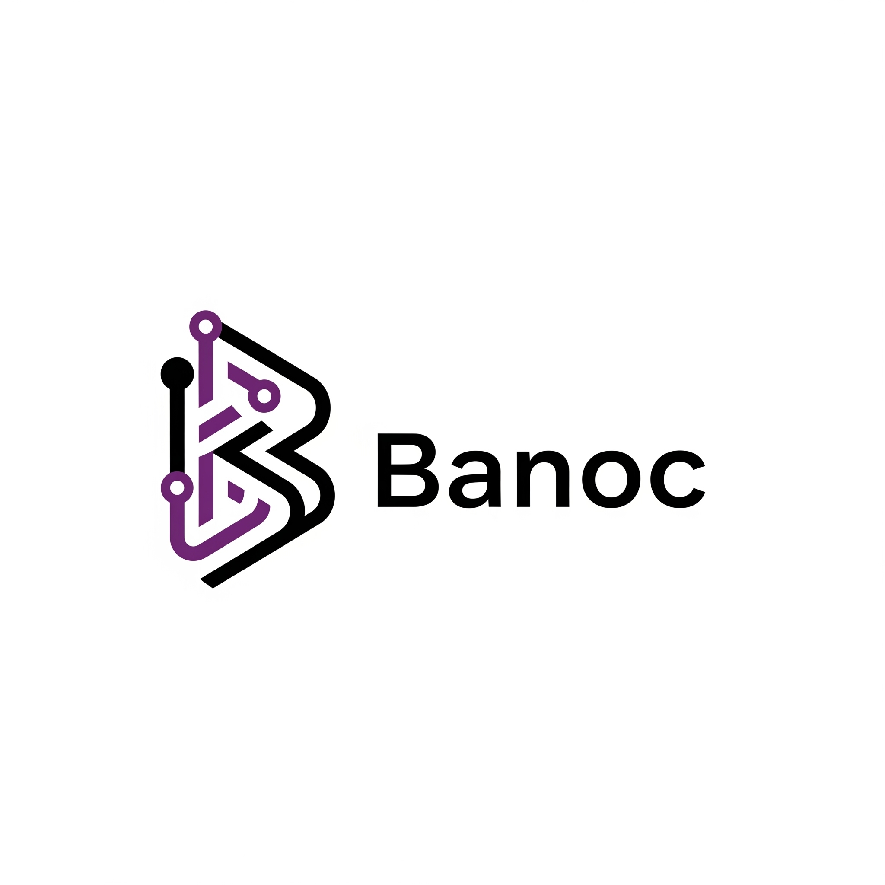

<div align="center">

<!---->

<h1>Financial File Parser</h1>
<p>
    API for consuming and processing bank statements from Brazilian banks.
</p>

<p>
  <a href="https://img.shields.io/github/last-commit/gusthawojunkes/financial-file-parser">
    
  </a>
  <a href="https://img.shields.io/github/last-commit/gusthawojunkes/financial-file-parser">
    
  </a>
  <a href="https://github.com/gusthawojunkes/financial-file-parser/issues/">
    
  </a>
  <a href="https://github.com/gusthawojunkes/financial-file-parser/blob/master/LICENSE">
    
  </a>
</p>

</div>

# :clipboard: Table of Contents

- [About the Project](#star-about-the-project)
    * [Technologies](#microscope-technologies)
    * [Tools](#wrench-tools)
- [Getting Started](#beginner-getting-started)
  * [Running the application](#computer-running-the-application)
  * [Running tests](#test_tube-running-tests)
- [License](#page_with_curl-license)
- [Contact](#handshake-contact)

## :star: About the project
This project aims to provide an API for consuming and processing bank statements from Brazilian banks. The main goal is to provide a simple and easy-to-use API for developers to consume and process bank statements.

### :microscope: Technologies
- [Kotlin](https://kotlinlang.org/)
- [Gradle](https://gradle.org/)
- [Ktor](https://ktor.io/)
- [Gson](https://github.com/google/gson)
- [Swagger](https://swagger.io/)
- [Kotlin Test](https://kotlinlang.org/api/latest/kotlin.test/)
- [Ktor Test](https://ktor.io/docs/server-testing.html)
- [JAXB](https://javaee.github.io/jaxb-v2/)
- [Logback](https://logback.qos.ch/)
### :wrench: Tools
- [IntelliJ IDEA](https://www.jetbrains.com/idea/)
- [Postman](https://www.postman.com/)


## :beginner: Getting Started

### :computer: Running the application
Clone the project
```bash
git clone https://github.com/gusthawojunkes/financial-file-parser.git
```
Go to the desired directory
```bash
cd financial-file-parser
```
On macOS/UNIX systems, you will need to make the gradlew Gradle helper script executable. To do that, use the chmod command:
```bash
chmod +x gradlew
```
Build the project
```bash
./gradlew build
```
Run the application
```bash
./gradlew run
```

### :test_tube: Running tests
To run tests, use the following command
```bash
./gradlew test
```

<!--
## Contributing
Incoming...
-->

## :page_with_curl: License

This project is licensed under the MIT License - see the [LICENSE](LICENSE) file for details.

## :handshake: Contact
LinkedIn: [Gusthawo Junkes](https://www.linkedin.com/in/gusthawojunkes/)
<br />
E-mail: [gusthawojunkes14@gmail.com](gusthawojunkes14@gmail.com)
